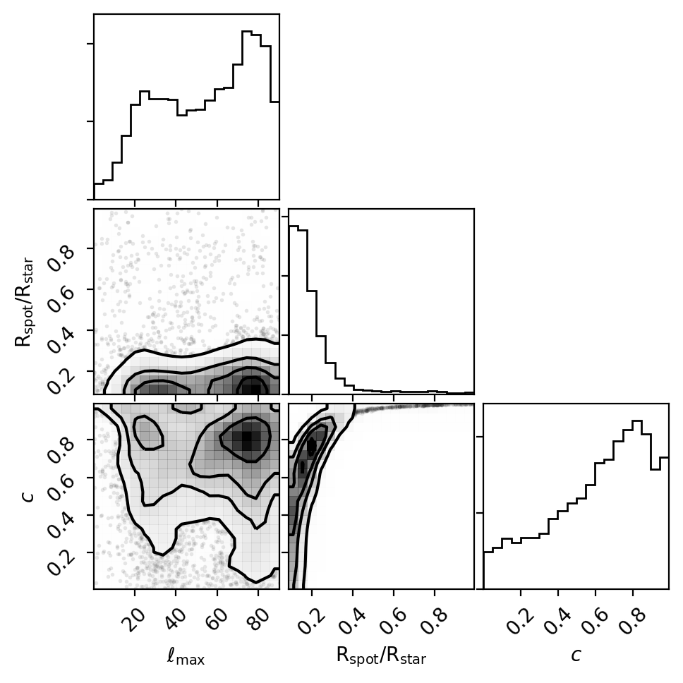

***********
ABC Example
***********

In this tutorial we'll measure spot properties for the FGK stars in Praesepe by
approximating the light curve smoothed amplitude distribution using `Approximate
Bayesian Computation (ABC) <https://en.wikipedia.org/wiki/Approximate_Bayesian_computation>`_.
We'll use ``astroquery`` to download the pre-calculated light curve smoothed amplitudes from
`Douglas et al. (2017) <https://ui.adsabs.harvard.edu/abs/2017ApJ...842...83D/abstract>`_.
We'll compute the two-sample `Anderson-Darling statistic
<https://en.wikipedia.org/wiki/Anderson–Darling_test>`_
as a summary statistic to measure whether how close the simulated light curve
amplitude distribution is to the observed distribution of smoothed amplitudes,
and accept steps in the chain that have small A-D statistics.

First let's import tools the standard Python science stack, plus ``astroquery``
and ``corner``::

    import matplotlib.pyplot as plt
    import numpy as np
    from scipy.stats import anderson_ksamp
    import astropy.units as u
    from astroquery.vizier import Vizier
    from corner import corner

    from fleck import generate_spots, Star

Let's use ``astroquery`` to retrieve the smoothed amplitudes of Praesepe FGK
stars::

    Vizier.ROW_LIMIT = -1

    v = Vizier(catalog='J/ApJ/842/83/table3', columns=["**"], row_limit=-1)
    table = v.query_constraints()[0]

    fgk_stars = (~table['SmAmp'].mask) & (table['Mass'] > 0.6 * u.Msun)
    amplitudes_praesepe = 2 * table['SmAmp'][fgk_stars].data

We must multiply the reported smoothed amplitudes by a factor of two as they
were recorded as semi-amplitudes by Douglas et al. (2017).

Let's set up our stellar sample properties, and prepare to measure 100 randomly
distributed stellar inclinations at each realization of the simulation::

    # quadratic limb darkening parameters
    ld = [0.5079, 0.2239]
    # Evaluate the model 30 times per rotation, set fiducial spot parameters
    stars = Star(spot_contrast=0.7, n_phases=30, u_ld=ld)
    n_inclinations = 100
    spot_radius = 0.2
    # Fix the number of spots on the star to three:
    n_spots = 3

We must also define the *summary statistic* which compares the simulated light
curve amplitude distribution to the observed one, for a given set of spot
parameters::

    def ad(spot_radius, max_latitude, spot_contrast):
        stars.spot_contrast = spot_contrast
        lons, lats, rads, incs = generate_spots(min_latitude=-max_latitude,
                                                max_latitude=max_latitude,
                                                n_spots=n_spots,
                                                spot_radius=spot_radius,
                                                n_inclinations=n_inclinations)
        lcs = stars.light_curve(lons, lats, rads, incs)

        # Convert light curves to smoothed amplitudes (%):
        smoothed_amps = 100 * lcs.ptp(axis=0)

        # Compute the Anderson-Darling statistic between the two samples in
        # log space:
        anderson_stat = anderson_ksamp([np.log10(smoothed_amps),
                                        np.log10(amplitudes_praesepe)]).statistic
        return anderson_stat

Finally we set up the chains and a ``while`` loop that will iterate until the
number of required step have been added to the chain::

    # Number of successful steps to iterate over
    n_steps = 5000

    # Initial spot parameters
    init_rad = 0.23
    init_max_lat = 70
    init_contrast = 0.7

    # Initialize chains with init step
    ad_stats = [ad(init_rad, init_max_lat, init_contrast)]
    spot_radii = [init_rad]
    max_lats = [init_max_lat]
    spot_contrasts = [init_contrast]
    steps = 0
    accepted_step = 0

    while accepted_step < n_steps:
        spot_radius = 0.05 * np.random.randn() + spot_radii[accepted_step]
        max_lat = 5 * np.random.randn() + max_lats[accepted_step]
        spot_contrast = 0.1 * np.random.randn() + spot_contrasts[accepted_step]

        # Apply prior
        if 0 < spot_radius < 1 and 0 < max_lat < 90 and 0 < spot_contrast < 1:
            adstat = ad(spot_radius, max_lat, spot_contrast)

            steps += 1

            # If summary statistic is less than threshold:
            if adstat < 0:
                # Accept step
                spot_radii.append(spot_radius)
                max_lats.append(max_lat)
                spot_contrasts.append(spot_contrast)
                ad_stats.append(adstat)
                accepted_step += 1

We can visualize the results by making a corner plot::

    fig, ax = plt.subplots(3, 3, figsize=(5, 5))
    samples = np.array([max_lats, spot_radii, spot_contrasts]).T
    corner(samples, labels='$\\rm\ell_{max}$ $\\rmR_{spot}/R_{star}$ $c$'.split(),
           smooth=True, fig=fig);
    plt.show()

The corner plot shows us the posterior distributions for the three spot
parameters: the maximum spot latitude :math:`\ell_{max}`,
the spot radius :math:`\rm R_{spot}/R_{star}`, and the spot contrast :math:`c`.
As we might expect, :math:`\rm R_{spot}/R_{star}` is degenerate with :math:`c`:
large spots with small contrasts can be swapped for smaller spots with higher
contrasts and produce equally good approximations to the smoothed amplitude
distribution of Praesepe stars.