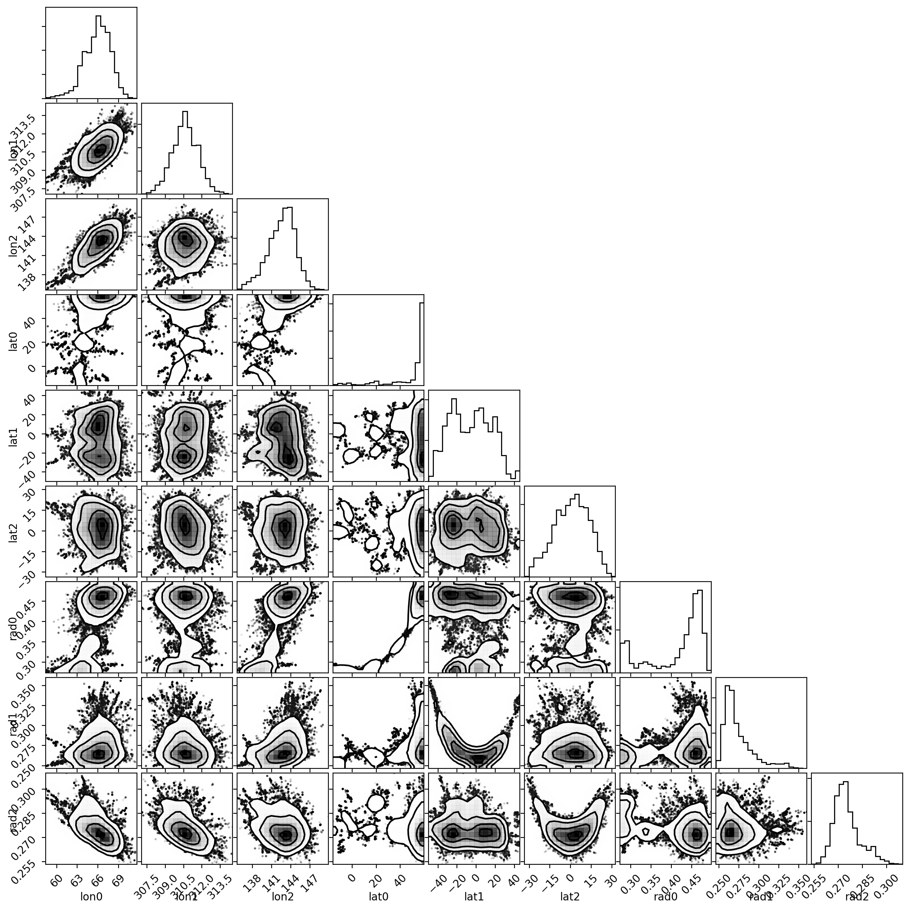
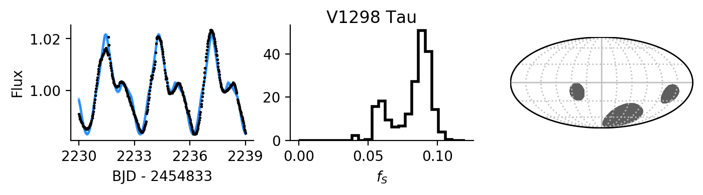

************
MCMC Example
************

In this tutorial, we'll fit the light curve of the 23 ± 4 Myr-old transiting
exoplanet star `V1298 Tau <https://arxiv.org/abs/1910.04563>`_ with ``fleck``.
It is interesting to apply ``fleck`` to V1298 Tau because it is young and
spotted, and has repeated spot signals over the duration of a few stellar
rotations. Here, we'll use ``lightkurve`` to download the K2 photometry,
``astropy`` to measure the stellar rotation period with a Lomb-Scargle,
periodogram, and finally ``fleck`` to model the rotational modulation of the
host star in order to invert the light curve for the spot properties: latitudes,
longitudes, and radii.

First, we import all of the required packages for this tutorial::

    import matplotlib.pyplot as plt
    import numpy as np
    from astropy.coordinates import SkyCoord
    from astropy.timeseries import LombScargle
    import astropy.units as u
    import healpy as hp
    from lightkurve import search_lightcurvefile
    from emcee import EnsembleSampler
    from multiprocessing import Pool
    from corner import corner
    from fleck import Star

Next we resolve the target coordinates using astropy, and download its light
curve using ``lightkurve``'s handy method::

    coord = SkyCoord.from_name('V1298 Tau')
    slcf = search_lightcurvefile(coord, mission='K2')

    lc = slcf.download_all()
    pdcsap = lc.PDCSAP_FLUX.stitch()

    time = pdcsap.time
    flux = pdcsap.flux

    notnanflux = ~np.isnan(flux)

    flux = flux[notnanflux & (time > 2230) & (time < 2239)]
    time = time[notnanflux & (time > 2230) & (time < 2239)]

    flux /= np.mean(flux)

Next, we want to determine the stellar rotation period, which will remain fixed
in our ``fleck`` analysis. We do this with a Lomb-Scargle periodogram::

    periods = np.linspace(1, 5, 1000) * u.day
    freqs = 1 / periods
    powers = LombScargle(time * u.day, flux).power(freqs)
    best_period = periods[powers.argmax()]

Now that we know that the best period is roughly 2.87 days, we can generate
``fleck`` light curves that reproduce the spot modulation::

    u_ld = [0.46, 0.11]
    contrast = 0.7
    phases = (time % best_period.value) / best_period.value
    s = Star(contrast, u_ld, n_phases=len(time), rotation_period=best_period.value)

    init_lons = np.array([0, 320, 100])
    init_lats = [0, 20, 0]
    init_rads = [0.01, 0.2, 0.3]

    yerr = 0.002

    init_p = np.concatenate([init_lons, init_lats, init_rads])

With our initial parameters set, we now define the functions that ``emcee`` uses
to do Markov Chain Monte Carlo::

    def log_likelihood(p):
        lons = p[0:3]
        lats = p[3:6]
        rads = p[6:9]

        lc = s.light_curve(lons[:, None] * u.deg, lats[:, None] * u.deg, rads[:, None],
                           inc_stellar=90*u.deg, times=time, time_ref=0)[:, 0]

        return - 0.5 * np.sum((lc/np.mean(lc) - flux)**2 / yerr**2)

    def log_prior(p):
        lons = p[0:3]
        lats = p[3:6]
        rads = p[6:9]

        if (np.all(rads < 1.) and np.all(rads > 0) and np.all(lats > -60) and
            np.all(lats < 60) and np.all(lons > 0) and np.all(lons < 360)):
            return 0
        return -np.inf

    def log_probability(p):
        lp = log_prior(p)
        if not np.isfinite(lp):
            return -np.inf
        return lp + log_likelihood(p)

We'll run the chains for a short period of time to see the results faster, but
to ensure convergence, you should run for 10-100x longer than this example::

    ndim = len(init_p)
    nwalkers = 5 * ndim
    nsteps = 5000

    pos = []

    while len(pos) < nwalkers:
        trial = init_p + 0.01 * np.random.randn(ndim)
        lp = log_prior(trial)
        if np.isfinite(lp):
            pos.append(trial)

    with Pool() as pool:
        sampler = EnsembleSampler(nwalkers, ndim, log_probability, pool=pool)
        sampler.run_mcmc(pos, nsteps, progress=True);

    samples_burned_in = sampler.flatchain[len(sampler.flatchain)//2:, :]

Now let's plot the corner plot with the posterior distributions and their
correlations using the ``corner`` package::

    fig, ax = plt.subplots(9, 9, figsize=(12, 12))
    labels = "lon0 lon1 lon2 lat0 lat1 lat2 rad0 rad1 rad2".split()
    corner(samples_burned_in, smooth=True, labels=labels,
           fig=fig);
    plt.show()

Finally, let's plot several draws from the posterior distributions for near the
maximum-likelihood light curve model, the total spot coverage posterior
distribution, and the spot map using ``healpy``::

    fig, ax = plt.subplots(1, 3, figsize=(8, 1.5))

    for i in np.random.randint(0, len(samples_burned_in), size=50):

        trial = samples_burned_in[i, :]

        lons = trial[0:3]
        lats = trial[3:6]
        rads = trial[6:9]

        lc = s.light_curve(lons[:, None] * u.deg, lats[:, None] * u.deg, rads[:, None],
                           inc_stellar=90*u.deg, times=time, time_ref=0)[:, 0]
        ax[0].plot(time, lc/lc.mean(), color='DodgerBlue', alpha=0.05)

    f_S = np.sum(samples_burned_in[:, -3:]**2 / 4, axis=1)

    ax[1].hist(f_S, bins=25, histtype='step', lw=2, color='k', range=[0, 0.12], density=True)
    ax[0].set(xlabel='BJD - 2454833', ylabel='Flux', xticks=[2230, 2233, 2236, 2239])
    ax[1].set_xlabel('$f_S$')
    ax[0].plot(time, flux, '.', ms=2, color='k', zorder=10)

    NSIDE = 2**10

    NPIX = hp.nside2npix(NSIDE)

    m = np.zeros(NPIX)

    np.random.seed(0)
    random_index = np.random.randint(samples_burned_in.shape[0]//2,
                                     samples_burned_in.shape[0])
    random_sample = samples_burned_in[random_index].reshape((3, 3)).T
    for lon, lat, rad in random_sample:
        t = np.radians(lat + 90)
        p = np.radians(lon)
        spot_vec = hp.ang2vec(t, p)
        ipix_spots = hp.query_disc(nside=NSIDE, vec=spot_vec, radius=rad)
        m[ipix_spots] = 0.7

    cmap = plt.cm.Greys
    cmap.set_under('w')

    plt.axes(ax[2])
    hp.mollview(m, cbar=False, title="", cmap=cmap, hold=True,
                max=1.0, notext=True, flip='geo')
    hp.graticule(color='silver')

    fig.suptitle('V1298 Tau')

    for axis in ax:
        for sp in ['right', 'top']:
            axis.spines[sp].set_visible(False)
    plt.show()

Finally, we can print the spot coverage::

    lo, mid, hi = np.percentile(f_S, [16, 50, 84])
    print(f"$f_S = {{{mid:g}}}^{{+{hi-mid:g}}}_{{-{mid-lo:g}}}$")

which returns :math:`f_S = {0.087}^{+0.006}_{-0.025}`.
